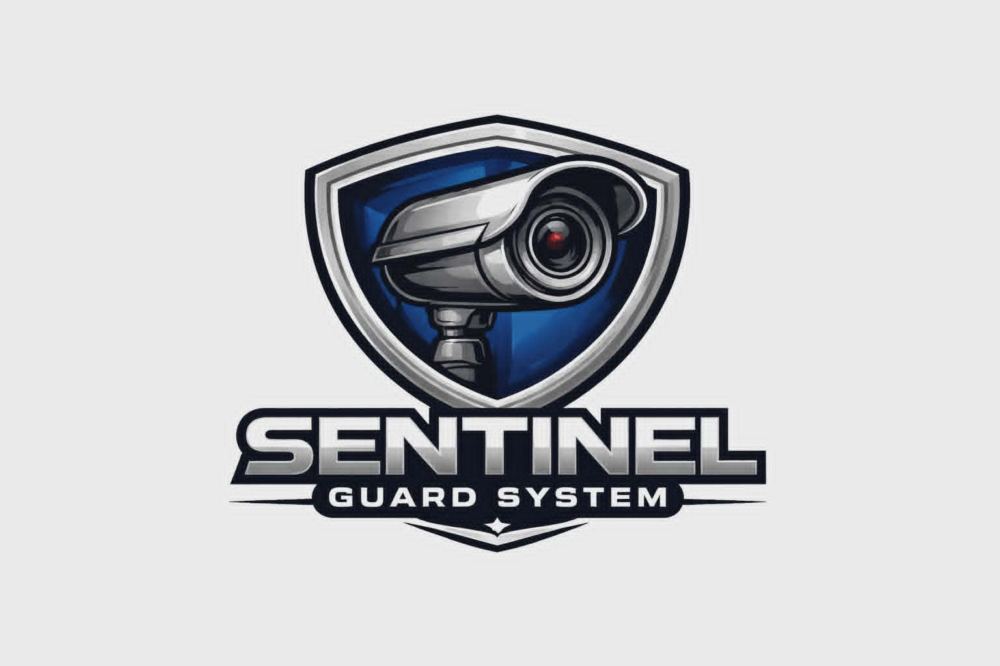

<html lang="en">
<head>
    <meta charset="UTF-8">
    <meta name="viewport" content="width=device-width, initial-scale=1.0">
    <title>Sentinel Guard System - Integrated Solutions</title>
    
</head>
<body>

    <header>
        

            

                <h1 class="logo-title">Sentinel Guard System</h1>
                
Integrated Solutions

                
Securing Today, Protecting Tomorrow

            

            

                
            

        

    </header>

    <nav>
        <ul class="nav-links">
            <li><a href="#quote">Request Quote</a></li>
            <li><a href="#packages">CCTV Packages</a></li>
            <li><a href="#services">Our Services</a></li>
            <li><a href="#hardware">Equipment</a></li>
            <li><a href="#coverage">Coverage Area</a></li>
            <li><a href="#contact">Contact Us</a></li>
        </ul>
    </nav>

    

        <!-- REQUEST QUOTE FORM -->
        <section id="quote">
            

                <h2 class="section-title">Request a Free Quote</h2>
                
Fill in your details, select a package, and send directly via WhatsApp or Messenger!

                <form id="quoteForm">
                    

                        <label for="clientName">Your Full Name:</label>
                        <input type="text" id="clientName" placeholder="e.g. Juan Dela Cruz" required>
                    

                    

                        <label for="clientLocation">Your Location / City:</label>
                        <input type="text" id="clientLocation" placeholder="e.g. Subic Bay, Olongapo, Bataan" required>
                    

                    

                        <label for="serviceType">Service / Package Interested In:</label>
                        <select id="serviceType" required>
                            <option value="">-- Select Service or Package --</option>
                            <option value="4-Channel CCTV Package (₱15,000)">4-Channel CCTV Package (₱15,000)</option>
                            <option value="8-Channel CCTV Package (₱26,900)">8-Channel CCTV Package (₱26,900)</option>
                            <option value="16-Channel CCTV Package (₱52,900)">16-Channel CCTV Package (₱52,900)</option>
                            <option value="CCTV Repair & Maintenance">CCTV Repair & Maintenance</option>
                            <option value="WiFi & LAN Network Installation">WiFi & LAN Network Installation</option>
                            <option value="Structured Cabling Solutions">Structured Cabling Solutions</option>
                            <option value="Gate Barrier & Vehicle Access System">Gate Barrier & Access Control</option>
                            <option value="Solar Power System">Solar Power System</option>
                            <option value="Other Custom Solution">Other Custom Security Solution</option>
                        </select>
                    

                    

                        <label for="clientNotes">Additional Details / Notes:</label>
                        <textarea id="clientNotes" rows="3" placeholder="Describe your site or camera needs..."></textarea>
                    

                    

                        <button type="button" onclick="sendWhatsAppQuote(event)" class="submit-btn whatsapp">
                            💬 Send via WhatsApp
                        </button>
                        <button type="button" onclick="sendMessengerQuote(event)" class="submit-btn messenger">
                            ⚡ Send via Messenger
                        </button>
                    

                </form>
            

        </section>

        <!-- SPECIAL PACKAGES -->
        <section id="packages">
            <h2 class="section-title">Special CCTV Packages</h2>
            

                
                

                    

                        
4 Channel Package

                        
₱15,000

                    

                    <ul class="package-features">
                        <li>✔️ HD CCTV Cameras (4x)</li>
                        <li>✔️ 4-Channel DVR Recorder</li>
                        <li>✔️ 500GB Hard Drive</li>
                        <li>✔️ 80 Meters RG6 Cable</li>
                        <li>✔️ Professional Installation</li>
                        <li>✔️ Mobile App Setup</li>
                    </ul>
                    

                        <a href="https://wa.me/639517656601?text=Hello%20Sentinel%20Guard%20System!%20I%20am%20interested%20in%20your%204-Channel%20CCTV%20Package%20(%E2%82%B115,000)." target="_blank" class="package-btn btn-whatsapp">
                            💬 WhatsApp
                        </a>
                        <a href="https://m.me/SentinelGuardSystem?text=Hello%20Sentinel%20Guard%20System!%20I%20am%20interested%20in%20your%204-Channel%20CCTV%20Package%20(%E2%82%B115,000)." target="_blank" class="package-btn btn-messenger">
                            ⚡ Messenger
                        </a>
                    

                

                

                    

                        Best Value
                        
8 Channel Package

                        
₱26,900

                    

                    <ul class="package-features">
                        <li>✔️ HD CCTV Cameras (8x)</li>
                        <li>✔️ 8-Channel DVR Recorder</li>
                        <li>✔️ 1TB Hard Drive</li>
                        <li>✔️ 160 Meters RG6 Cable</li>
                        <li>✔️ Professional Installation</li>
                        <li>✔️ Mobile App Setup</li>
                    </ul>
                    

                        <a href="https://wa.me/639517656601?text=Hello%20Sentinel%20Guard%20System!%20I%20am%20interested%20in%20your%208-Channel%20CCTV%20Package%20(%E2%82%B126,900)." target="_blank" class="package-btn btn-whatsapp">
                            💬 WhatsApp
                        </a>
                        <a href="https://m.me/SentinelGuardSystem?text=Hello%20Sentinel%20Guard%20System!%20I%20am%20interested%20in%20your%208-Channel%20CCTV%20Package%20(%E2%82%B126,900)." target="_blank" class="package-btn btn-messenger">
                            ⚡ Messenger
                        </a>
                    

                

                

                    

                        
16 Channel Package

                        
₱52,900

                    

                    <ul class="package-features">
                        <li>✔️ HD CCTV Cameras (16x)</li>
                        <li>✔️ 16-Channel DVR Recorder</li>
                        <li>✔️ 1TB Hard Drive</li>
                        <li>✔️ 320 Meters RG6 Cable</li>
                        <li>✔️ Professional Installation</li>
                        <li>✔️ Mobile App Setup</li>
                    </ul>
                    

                        <a href="https://wa.me/639517656601?text=Hello%20Sentinel%20Guard%20System!%20I%20am%20interested%20in%20your%2016-Channel%20CCTV%20Package%20(%E2%82%B152,900)." target="_blank" class="package-btn btn-whatsapp">
                            💬 WhatsApp
                        </a>
                        <a href="https://m.me/SentinelGuardSystem?text=Hello%20Sentinel%20Guard%20System!%20I%20am%20interested%20in%20your%2016-Channel%20CCTV%20Package%20(%E2%82%B152,900)." target="_blank" class="package-btn btn-messenger">
                            ⚡ Messenger
                        </a>
                    

                

            

        </section>

        <!-- SERVICES -->
        <section id="services">
            <h2 class="section-title">Our Services</h2>
            

                

                    

                        <h3>CCTV Surveillance Systems</h3>
                        
HD security camera installation, maintenance, and remote mobile viewing.

                    

                    

                        <a href="https://wa.me/639517656601?text=Hello%20Sentinel%20Guard%20System!%20I%20want%20to%20request%20a%20quote%20for%20CCTV%20Surveillance%20Systems." target="_blank" class="service-link wa">💬 WhatsApp</a>
                        <a href="https://m.me/SentinelGuardSystem?text=Hello%20Sentinel%20Guard%20System!%20I%20want%20to%20request%20a%20quote%20for%20CCTV%20Surveillance%20Systems." target="_blank" class="service-link msg">⚡ Messenger</a>
                    

                

                

                    

                        <h3>WiFi & LAN Network Installation</h3>
                        
Fast, stable, and secure internet connectivity for homes and businesses.

                    

                    

                        <a href="https://wa.me/639517656601?text=Hello%20Sentinel%20Guard%20System!%20I%20want%20to%20request%20a%20quote%20for%20WiFi%20%26%20LAN%20Network%20Installation." target="_blank" class="service-link wa">💬 WhatsApp</a>
                        <a href="https://m.me/SentinelGuardSystem?text=Hello%20Sentinel%20Guard%20System!%20I%20want%20to%20request%20a%20quote%20for%20WiFi%20%26%20LAN%20Network%20Installation." target="_blank" class="service-link msg">⚡ Messenger</a>
                    

                

                

                    

                        <h3>Structured Cabling Solutions</h3>
                        
Neat, organized cabling for optimal network performance and longevity.

                    

                    

                        <a href="https://wa.me/639517656601?text=Hello%20Sentinel%20Guard%20System!%20I%20want%20to%20request%20a%20quote%20for%20Structured%20Cabling%20Solutions." target="_blank" class="service-link wa">💬 WhatsApp</a>
                        <a href="https://m.me/SentinelGuardSystem?text=Hello%20Sentinel%20Guard%20System!%20I%20want%20to%20request%20a%20quote%20for%20Structured%20Cabling%20Solutions." target="_blank" class="service-link msg">⚡ Messenger</a>
                    

                

                

                    

                        <h3>Gate Barrier & Vehicle Access</h3>
                        
Smart controlled vehicle access systems for residential and commercial sites.

                    

                    

                        <a href="https://wa.me/639517656601?text=Hello%20Sentinel%20Guard%20System!%20I%20want%20to%20request%20a%20quote%20for%20Gate%20Barrier%20%26%20Vehicle%20Access%20Systems." target="_blank" class="service-link wa">💬 WhatsApp</a>
                        <a href="https://m.me/SentinelGuardSystem?text=Hello%20Sentinel%20Guard%20System!%20I%20want%20to%20request%20a%20quote%20for%20Gate%20Barrier%20%26%20Vehicle%20Access%20Systems." target="_blank" class="service-link msg">⚡ Messenger</a>
                    

                

                

                    

                        <h3>Access Control & Door Entry</h3>
                        
Keypad, smart card, and biometric entry solutions for secure areas.

                    

                    

                        <a href="https://wa.me/639517656601?text=Hello%20Sentinel%20Guard%20System!%20I%20want%20to%20request%20a%20quote%20for%20Access%20Control%20%26%20Door%20Entry." target="_blank" class="service-link wa">💬 WhatsApp</a>
                        <a href="https://m.me/SentinelGuardSystem?text=Hello%20Sentinel%20Guard%20System!%20I%20want%20to%20request%20a%20quote%20for%20Access%20Control%20%26%20Door%20Entry." target="_blank" class="service-link msg">⚡ Messenger</a>
                    

                

                

                    

                        <h3>Solar Power Systems</h3>
                        
Sustainable, cost-effective power solutions tailored to your energy needs.

                    

                    

                        <a href="https://wa.me/639517656601?text=Hello%20Sentinel%20Guard%20System!%20I%20want%20to%20request%20a%20quote%20for%20Solar%20Power%20Systems." target="_blank" class="service-link wa">💬 WhatsApp</a>
                        <a href="https://m.me/SentinelGuardSystem?text=Hello%20Sentinel%20Guard%20System!%20I%20want%20to%20request%20a%20quote%20for%20Solar%20Power%20Systems." target="_blank" class="service-link msg">⚡ Messenger</a>
                    

                

            

        </section>

        <!-- HARDWARE -->
        <section id="hardware">
            <h2 class="section-title">Integrated Hardware</h2>
            

                
<h4>Bullet & Dome Cameras</h4>

                
<h4>NVR & DVR Recorders</h4>

                
<h4>PoE Switches</h4>

                
<h4>Security Monitors</h4>

                
<h4>Gate Barrier Systems</h4>

                
<h4>Intercom & Keypads</h4>

                
<h4>Smart Locks</h4>

                
<h4>Routers & Wi-Fi APs</h4>

            

        </section>

        <!-- CONTACT & INFO -->
        <section id="contact">
            

                

                    <h3>Contact Us Directly</h3>
                    <ul class="contact-list">
                        <li>📞 <strong>Call Us:</strong> <a href="tel:09517656601">09517656601</a></li>
                        <li>💬 <strong>WhatsApp:</strong> <a href="https://wa.me/639517656601?text=Hello%20Sentinel%20Guard%20System!" target="_blank">09517656601</a></li>
                        <li>⚡ <strong>Messenger:</strong> <a href="https://m.me/SentinelGuardSystem" target="_blank">Sentinel Guard System</a></li>
                        <li>✉️ <strong>Email:</strong> <a href="mailto:sentinelguardsystem@gmail.com">sentinelguardsystem@gmail.com</a></li>
                    </ul>
                

                

                    <h3>Service Coverage Area</h3>
                    

                        📍 <strong>Olongapo City</strong> 
                        📍 <strong>Subic Bay Freeport Zone</strong> 
                        📍 <strong>Zambales</strong> 
                        📍 <strong>Bataan</strong> 
                        <em>(and nearby provinces)</em>
                    

                

            

        </section>

    

    <footer>
        
&copy; Sentinel Guard System. All Rights Reserved.

        

            SECURE YOU CAN TRUST • 
            SERVICE YOU CAN RELY ON
        

    </footer>

    

// Auto-fill message when package/service is selected
document.getElementById('serviceType').addEventListener('change', function () {

    const service = this.value;

    const packageDetails = {
        "4-Channel CCTV Package (₱15,000)":
            "• 4 HD CCTV Cameras\n• 4-Channel DVR\n• 500GB HDD\n• 80m RG6 Cable\n• Installation Included",

        "8-Channel CCTV Package (₱26,900)":
            "• 8 HD CCTV Cameras\n• 8-Channel DVR\n• 1TB HDD\n• 160m RG6 Cable\n• Installation Included",

        "16-Channel CCTV Package (₱52,900)":
            "• 16 HD CCTV Cameras\n• 16-Channel DVR\n• 1TB HDD\n• 320m RG6 Cable\n• Installation Included",

        "CCTV Repair & Maintenance":
            "CCTV Repair and Preventive Maintenance Service",

        "WiFi & LAN Network Installation":
            "WiFi and LAN Network Installation Service",

        "Structured Cabling Solutions":
            "Structured Cabling Solutions",

        "Gate Barrier & Access Control":
            "Gate Barrier and Access Control System",

        "Solar Power System":
            "Solar Power System Installation",

        "Other Custom Security Solution":
            "Custom Security Solution"
    };

    if (service !== "") {

        const message =
`Hello Sentinel Guard System!

I am interested in the following package/service:

📦 ${service}

${packageDetails[service] || ""}

Please send me complete details, installation schedule, and quotation.

Thank you.`;

        document.getElementById('clientNotes').value = message;
    }
});

// Build final message
function getFormDetails() {

    var name = document.getElementById('clientName').value.trim();
    var location = document.getElementById('clientLocation').value.trim();
    var notes = document.getElementById('clientNotes').value.trim();

    return `Hello Sentinel Guard System!

👤 Name: ${name}
📍 Location: ${location}

${notes}

Thank you.`;
}

// WhatsApp
function sendWhatsAppQuote() {

    if (!validateForm()) return;

    var phoneNumber = "639517656601";
    var message = getFormDetails();

    window.open(
        "https://wa.me/" +
        phoneNumber +
        "?text=" +
        encodeURIComponent(message),
        "_blank"
    );
}

// Messenger
function sendMessengerQuote() {

    if (!validateForm()) return;

    var pageUsername = "SentinelGuardSystem";
    var message = getFormDetails();

    window.open(
        "https://m.me/" +
        pageUsername +
        "?text=" +
        encodeURIComponent(message),
        "_blank"
    );
}

<textarea id="clientNotes"
rows="6"
placeholder="Message will be automatically generated when you select a package...">
</textarea>
